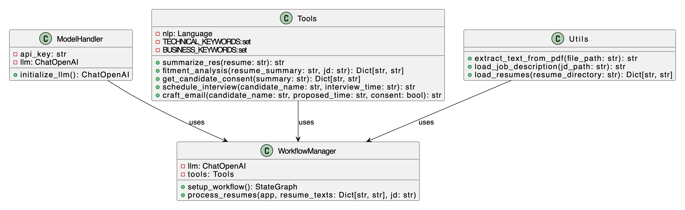

# HR Project

An automated system for processing resumes, performing job fitment analysis, and managing interviews, built with Python, spaCy, and LangChain.

## Features

- **Resume Summarization**: Extracts key technical and business terms.
- **Fitment Analysis**: Compares resumes with job descriptions.
- **Interview Management**: Automates candidate consent, scheduling, and email notifications.

## Installation

1. **Clone the Repository and get in the dir **:
   ```bash
   git clone https://github.com/yourusername/hrproject.git
   cd HRproject
1. **Install the req.txt**:
   ```bash
   pip install -r /content/HRproject/requirements.txt

1. **run the main script**:
   ```bash
   python3 main.py




